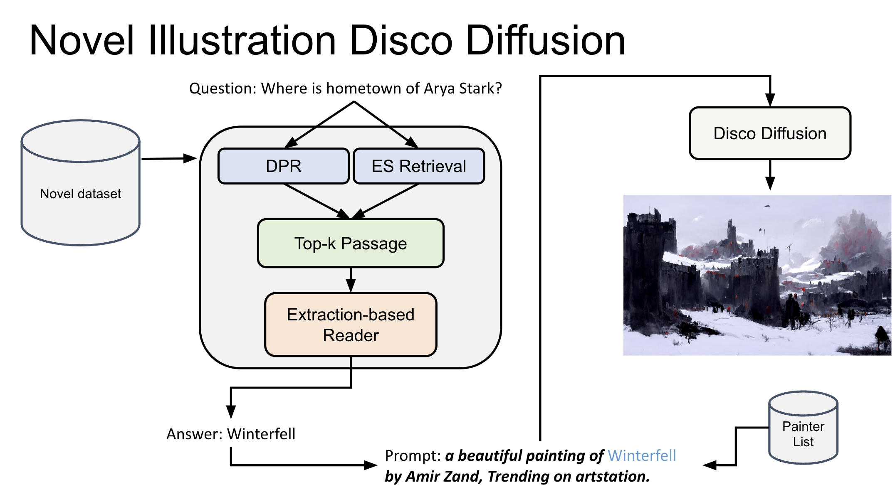
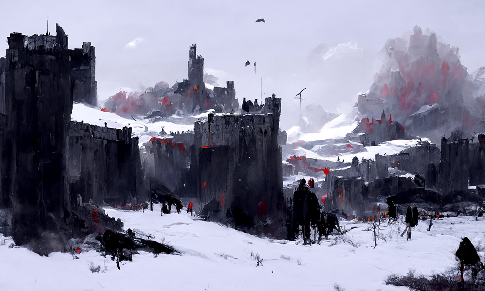

# novel-illustration-disco-diffusion

**[Presentation](https://docs.google.com/presentation/d/1Eqa9TNg_kxKNZDyDHA2HxYeKfrgrp2dx/edit?usp=sharing&ouid=108867471698138933426&rtpof=true&sd=true)**

## Overview

The pipeline for generating image from question that users are curious about.

The best scenario is Novel-well-known user makes pretty good prompt for generating model. But novel has lots of inofrmations and users can't remember all the information about novel.

So, user makes question thath users are curious about, and pipeline makes image which can representate answer about question.

## Example
- Novel: A Game of Thrones
- Quesiton: Where is hometown of Arya Stark?
- Answer: Winterfell
- Prompt: a beautiful painting of Winterfell by Amir Zand, Trending on artstation.
- Generated image

## Pipeline
1. Question about novel is put in to Qusetion-Answering(QA) model.
2. QA model generates best answer.
3. Post-processing answer for making pretty prompt.
4. Prompt is put in Disco Diffusion and model generates image.

## Question Answering
1. DPR(Dense Passage Retriever) and ES(Elastic Search) try to find the most relevant top-k passage or page.
2. Extraction-based Reader model try to find the answer about question.

## Disco Diffusion
CLIP guidance Diffusion model, pretrained by OpenAI.

## Referene 
Original Disco Diffusion: https://colab.research.google.com/github/alembics/disco-diffusion/blob/main/Disco_Diffusion.ipynb  
Diffusion model: https://github.com/openai/guided-diffusion